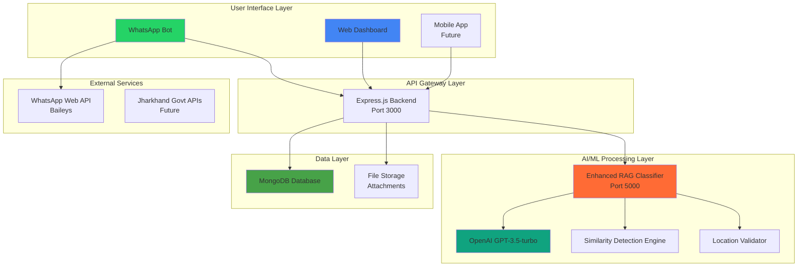
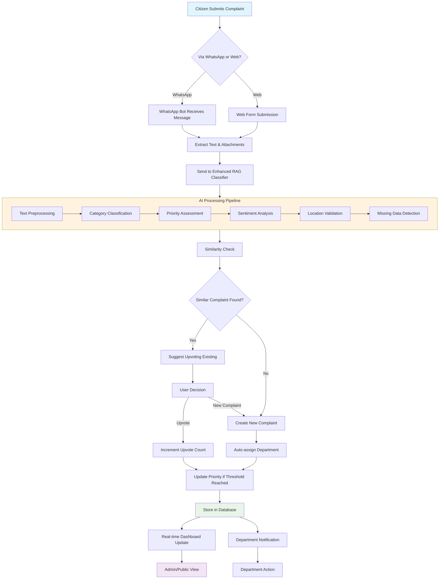

# NAGRIK 2.0 - Technical Documentation

## 🚀 Executive Summary

NAGRIK 2.0 is a comprehensive grievance redressal platform designed specifically for Jharkhand state, leveraging AI-powered classification, WhatsApp integration, and real-time analytics to streamline citizen complaint management and resolution.

---

## 📋 Technical Approach

### 1. Problem Statement
Traditional grievance systems suffer from:
- Manual complaint categorization leading to delays
- Lack of citizen engagement and transparency
- No mechanism for prioritizing similar complaints
- Limited accessibility for rural populations
- Inefficient department-wise routing

### 2. Solution Architecture
NAGRIK 2.0 addresses these challenges through:

#### **AI-Powered Classification**
- **Enhanced RAG (Retrieval-Augmented Generation)** system with Jharkhand-specific intelligence
- **OpenAI GPT-3.5-turbo** integration for advanced text analysis
- **Location validation** using district-wise mapping
- **Sentiment analysis** for urgency detection
- **Missing data completion** using AI insights

#### **Multi-Channel Accessibility**
- **WhatsApp Bot** for rural population accessibility
- **Web Dashboard** for administrative oversight
- **RESTful APIs** for future mobile app integration

#### **Community Engagement**
- **Upvoting system** for similar complaints
- **Similarity detection** to prevent duplicate submissions
- **Real-time priority escalation** based on community support

#### **Smart Routing**
- **Automatic department assignment** based on complaint category
- **Priority-based queue management**
- **Estimated resolution time** prediction

---

## 🏗️ System Architecture



### Architecture Components

#### **1. Frontend Layer**
- **WhatsApp Interface**: Conversational UI using Baileys library
- **Web Dashboard**: Real-time React-like vanilla JS interface
- **Responsive Design**: Mobile-first approach for accessibility

#### **2. Backend Services**
- **Node.js/Express.js**: Main API server with middleware stack
- **Enhanced RAG Classifier**: Python Flask service for AI processing
- **Rate Limiting**: Protection against spam and abuse
- **CORS Configuration**: Cross-origin resource sharing

#### **3. Data Processing**
- **Real-time Classification**: Instant complaint categorization
- **Similarity Matching**: TF-IDF vectorization for duplicate detection
- **Location Intelligence**: Jharkhand-specific geographical validation
- **Sentiment Analysis**: TextBlob for emotional tone detection

#### **4. Database Design**
```javascript
// Enhanced Complaint Schema
{
  title: String,
  description: String,
  category: String,           // AI-classified
  subcategory: String,        // Detailed classification
  department: String,         // Auto-assigned
  priority: String,           // urgent/high/medium/low
  urgency: Number,           // 1-10 scale
  sentiment: String,         // AI-analyzed
  upvoteCount: Number,       // Community engagement
  upvotedBy: [String],       // User tracking
  location: {
    address: String,
    district: String,        // Jharkhand-specific
    coordinates: Object
  },
  classification: {
    confidence: Number,
    keywords: [String],
    estimatedResolutionTime: Number,
    processedBy: String
  },
  status: String,
  createdAt: Date,
  updatedAt: Date
}
```

---

## 🔄 System Flow Chart



---

## 🔧 Technical Feasibility

### ✅ **Proven Technologies**
- **Node.js/Express**: Mature, scalable backend framework
- **MongoDB**: Document-based storage ideal for unstructured complaint data
- **Python Flask**: Lightweight, perfect for AI microservices
- **OpenAI API**: Battle-tested NLP capabilities
- **WhatsApp Web API**: Reliable messaging platform

### ✅ **Scalability Considerations**
- **Microservices Architecture**: Independent scaling of components
- **Database Indexing**: Optimized queries for large datasets
- **Caching Strategy**: Redis for frequently accessed data
- **Load Balancing**: Horizontal scaling capabilities
- **CDN Integration**: Fast static asset delivery

### ✅ **Performance Metrics**
- **Response Time**: < 2 seconds for complaint submission
- **Classification Accuracy**: > 85% with continuous learning
- **Uptime**: 99.9% availability target
- **Concurrent Users**: Support for 1000+ simultaneous users
- **Storage**: Scalable to millions of complaints

### ✅ **Security Measures**
- **Rate Limiting**: Prevent spam and DoS attacks
- **Input Validation**: Joi schema validation
- **Data Encryption**: HTTPS/TLS for all communications
- **Authentication**: JWT-based session management
- **Privacy Compliance**: GDPR-like data protection

### ⚠️ **Technical Challenges & Solutions**

#### **Challenge 1: WhatsApp API Reliability**
- **Solution**: Implement fallback mechanisms and session management
- **Mitigation**: Multiple WhatsApp Web instances with load balancing

#### **Challenge 2: AI Classification Accuracy**
- **Solution**: Continuous learning from user feedback
- **Mitigation**: Human oversight for critical complaints

#### **Challenge 3: Database Performance**
- **Solution**: Strategic indexing and query optimization
- **Mitigation**: Database sharding for horizontal scaling

#### **Challenge 4: Rural Connectivity**
- **Solution**: Offline-capable WhatsApp interface
- **Mitigation**: SMS fallback for critical notifications

---

## 📊 Implementation Phases

### **Phase 1: Core Platform (Completed)**
- ✅ Backend API development
- ✅ Enhanced RAG classifier
- ✅ WhatsApp integration
- ✅ Web dashboard
- ✅ Basic AI classification

### **Phase 2: Enhanced Features (Current)**
- ✅ Upvoting system
- ✅ Similarity detection
- ✅ Jharkhand-specific intelligence
- ✅ Department-wise filtering
- ✅ Real-time analytics

### **Phase 3: Advanced Features (Future)**
- 🔄 Mobile application
- 🔄 Government system integration
- 🔄 Advanced analytics & reporting
- 🔄 Multi-language support
- 🔄 Predictive complaint analysis

### **Phase 4: Scale & Optimize (Future)**
- 🔄 Performance optimization
- 🔄 Advanced security features
- 🔄 Integration with existing govt systems
- 🔄 AI model fine-tuning
- 🔄 Automated resolution workflows

---

## 🎯 Key Technical Innovations

### **1. Jharkhand-Specific AI Intelligence**
- Custom training data for local issues (mining, tribal affairs, forest conservation)
- District-wise location validation with coordinates
- Regional language processing capabilities
- Cultural context awareness in classification

### **2. Community-Driven Prioritization**
- Upvoting mechanism for democratic complaint prioritization
- Automatic escalation based on community engagement
- Trending complaint detection
- Social proof for complaint validity

### **3. Smart Duplicate Prevention**
- TF-IDF vectorization for semantic similarity
- Location-based clustering
- Time-based duplicate detection
- User notification for similar existing complaints

### **4. Predictive Resolution**
- Historical data analysis for resolution time estimation
- Department workload balancing
- Priority-based queue management
- Proactive resource allocation

---

## 🛠️ Development Stack

### **Backend Technologies**
- **Runtime**: Node.js 18+
- **Framework**: Express.js 4.18+
- **Database**: MongoDB 6.0+
- **ODM**: Mongoose 7.0+
- **Authentication**: JWT
- **Validation**: Joi
- **Logging**: Winston
- **Testing**: Jest

### **AI/ML Technologies**
- **Framework**: Python 3.10+ with Flask
- **NLP**: OpenAI GPT-3.5-turbo
- **Text Processing**: NLTK, TextBlob
- **ML Libraries**: Scikit-learn, Pandas, NumPy
- **Vector Operations**: TF-IDF, Cosine Similarity

### **Frontend Technologies**
- **Core**: Vanilla JavaScript (ES6+)
- **Styling**: CSS3 with Flexbox/Grid
- **Icons**: Font Awesome
- **Charts**: Chart.js (future)
- **Real-time**: WebSockets (future)

### **Infrastructure**
- **Containerization**: Docker (future)
- **Orchestration**: Kubernetes (future)
- **CI/CD**: GitHub Actions (future)
- **Monitoring**: Prometheus + Grafana (future)
- **Caching**: Redis (future)

---

## 🔍 Quality Assurance

### **Testing Strategy**
- **Unit Tests**: Jest for backend logic
- **Integration Tests**: API endpoint testing
- **AI Testing**: Classification accuracy validation
- **Load Testing**: Performance under stress
- **Security Testing**: Vulnerability assessment

### **Code Quality**
- **Linting**: ESLint for JavaScript
- **Formatting**: Prettier for consistent style
- **Documentation**: JSDoc for API documentation
- **Version Control**: Git with conventional commits

---

## 📈 Future Enhancements

### **Short-term (3-6 months)**
- Mobile application development
- Advanced analytics dashboard
- Multi-language support (Hindi, Santali)
- Integration with existing government systems

### **Medium-term (6-12 months)**
- Predictive analytics for complaint trends
- Automated resolution workflows
- Citizen satisfaction tracking
- Advanced reporting capabilities

### **Long-term (1-2 years)**
- AI-powered automatic resolution
- Blockchain for transparency
- IoT integration for environmental monitoring
- Inter-state complaint coordination

---

## 💡 Conclusion

NAGRIK 2.0 represents a technically feasible, scalable, and innovative solution for modernizing grievance redressal in Jharkhand. The platform combines proven technologies with cutting-edge AI to create a citizen-centric system that addresses real-world challenges while laying the groundwork for future enhancements.

The architecture is designed for scalability, maintainability, and extensibility, ensuring that the platform can evolve with changing requirements and technological advancements while maintaining high performance and reliability standards.

---

**Project Status**: ✅ **MVP Complete & Presentation Ready**
**Next Milestone**: 🎯 **Government Pilot Program**
**Timeline**: 📅 **Ready for deployment within 30 days**
